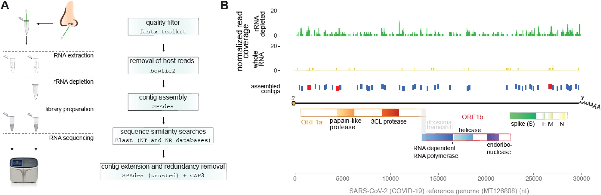

<a name="home"></a>
  
## I Relecov Biohackathon
## Group 4
Participants:
Joan Gibert Fernandez
Joan R Grande
José Miguel Lorenzo Salazar
Sarai Varona

## Tasks

<ul>
  <li><a href="#BibliographySeeking">Task 1. Bibliography seeking.</a></li>
  <li><a href="#IonTorrentData">Task 2. Provide Ion Torrent data set.</a></li>
  <li><a href="#SoftwareImplementation">Task 3. Software implementation: preprocessing, mapping and variant calling.</a></li>
</ul>

## Hackathon in detail
<ul>
  <li><a href="#Day1">Day 1</a></i>
  <li><a href="#Day2">Day 2</a></i>
  <li><a href="#Day3">Day 1</a></i>
</ul>

---

<a name="Day1"></a>
### Day 1

<!-- ************************** SECTION HERE -->

Helps
- [MarkDown cheatsheet](https://www.markdownguide.org/cheat-sheet/)
- [NF code of ViralRecon](https://github.com/jlorsal/viralrecon)

---

<a name="BibliographySeeking"></a>
### Task 1: Bibliography Seeking

- **SARS-CoV-2 RECoVERY: a multi-platform open-source bioinformatic pipeline for the automatic construction and 
analysis of SARS-CoV-2 genomes from NGS sequencing data**. 

Sabato, L. D. et al. (2021).

[DOI](https://doi.org/10.1101/2021.01.16.425365)

[bioRxiv](https://www.biorxiv.org/content/10.1101/2021.01.16.425365v1)

Available at Galaxy: [](https://https//aries.iss.it)

[Github](https://github.com/aknijn/sars-cov-2-recovery)

[Flowchart](https://github.com/aknijn/sars-cov-2-recovery/blob/main/sars-cov-2-recovery.png)


---

- **A Novel SARS-CoV-2 Viral Sequence Bioinformatic Pipeline Has Found Genetic Evidence That the Viral 3′ Untranslated Region (UTR) Is Evolving and Generating Increased Viral Diversity**

Carlos Farkas et al. (2021).

[DOI](https://doi.org/10.3389/fmicb.2021.665041)

[Journal](https://www.frontiersin.org/articles/10.3389/fmicb.2021.665041/full)

[GitHub]( https://github.com/cfarkas/SARS-CoV-2-freebayes)

[Galaxy Project](https://usegalaxy.org/u/carlosfarkas/h/snpeffsars-cov-2)


---

- **ASPICov: An automated pipeline for identification of SARS-Cov2 nucleotidic variants**

Valentin Tilloy et al. 

[DOI](https://doi.org/10.1371/journal.pone.0262953)

[Journal](https://journals.plos.org/plosone/article?id=10.1371/journal.pone.0262953)

[Workflow](https://journals.plos.org/plosone/article/figure/image?size=large&id=10.1371/journal.pone.0262953.g001)

[GitLab](https://gitlab.com/vtilloy/aspicov)

Singularity images


---

- **Ion torrent-based nasopharyngeal swab metatranscriptomics in COVID-19**

Gubio S. Campos et al. (2020).

[DOI](https://doi.org/10.1016/j.jviromet.2020.113888)

[Journal]https://www.sciencedirect.com/science/article/pii/S0166093420301403)

Workflow:




---

- **Comparison of Illumina MiSeq and the Ion Torrent PGM and S5 platforms for whole-genome sequencing of picornaviruses and caliciviruses**

Rachel L. Marine et atl. (2020).

[DOI](https://doi.org/10.1016/j.jviromet.2020.113865)

[Journal](https://www.sciencedirect.com/science/article/pii/S0166093420301178)

  <p align="right" dir="auto">
   <a href="#home" title="Up">
    
   </a>
 </p>
  

---
  
<!-- ************************** SECTION HERE -->

<a name="IonTorrentData"></a>
### Task 2: Ion Torrent dataset

- Use FASTQ files from IonTorrent sequencing technology (PGM and/or S5) from the HERA project as benchmarking to test Viral-Recon. We have access to FASTQ files for ten known samples provided by BU-ISCIII. We want to test:
  <ol>
    <li>The raw FASTQ files into Viral-Recon.</li>
    <li>The uBam files (some sort of raw FASTQ format file from IonTorrent).</li>
    <li>The FASTQ files with some preprocessing filtering (BQ>20).</li>
  </ol>
- Test directly with the FASTQ files provided (if any) into Viral-Recon.
- Set a BaseQuality filter (?) and other possible filters (depending on the noise within the input reads, specially in indels) in the config of Viral-Recon.
- ...

  <p align="right" dir="auto">
   <a href="#home" title="Up">
    
   </a>
 </p>
  
  
---

<!-- ************************** SECTION HERE -->
 
<a name="SoftwareImplementation"></a>
### Task 3: Software Implementation

- Check if a UBam-to-FASTQ is needed depending on the IonTorrent datasets provided.
- ...

**Tools to preprocess the Ion Torrent FASTQ files in case they are provided as BAM or uBAM**

**How to perform BAM-to-FASTQ**

> [Samtools: bam2fq](http://www.htslib.org/doc/1.1/samtools.html)

```Bash
inBAM="unsorted.bam"
outBAM="sorted.bam"

# Sort paired-end read alignment in BAM file (sort by name -n)
samtools sort -n ${inBAM} -o ${outBAM}

# Convert BAM to single FASTQ
BAM="sorted.bam"
FASTQ="output.fastq"
samtools bam2fq ${BAM} > ${FASTQ}

# Convert BAM into separate R1 and R2 FASTQ files
BAM="sorted.bam"
FASTQ1="sample_R1.fastq"
FASTQ2="sample_R2.fastq"
samtools fastq -@ 8 ${BAM} \
    -1 ${FASTQ1} \
    -2 ${FASTQ2} \
    -0 /dev/null -s /dev/null -n
```

> [BEDtools: bamtofastq](https://bedtools.readthedocs.io/en/latest/content/tools/bamtofastq.html)

```Bash
BAM="input.bam"
FASTQ1="forward.fastq"
FASTQ2="reverse.fastq"
bedtools bamtofastq -i ${BAM} -fq ${FASTQ1} -fq2 ${FASTQ2}
```

> [PICARD](http://broadinstitute.github.io/picard/command-line-overview.html#SamToFastq)
```Bash
BAM="input.bam"
FASTQ1="forward.fastq"
FASTQ2="reverse.fastq"
java -Xmx2g -jar Picard-SamToFastq.jar \
    I=${BAM} \
    F=${FASTQ1} \
    F2=${FASTQ2}

#Note, F2 to get paired-end fastq files (R1 and R2)
```

> [bamtools](https://github.com/pezmaster31/bamtools)

```Bash
BAM="input.bam"
FASTQ="output.fastq"
bamtools convert -in ${BAM} --format fastq > ${FASTQ}

# Split an interleaved FASTQ extracting reads ending with '/1' or '/2'
FASTQ="interleaved.fastq"
FASTQ1="forward.fastq"
FASTQ2="reverse.fastq"
cat ${FASTQ} | grep '^@.*/1$' -A 3 --no-group-separator > ${FASTQ1}
cat ${FASTQ} | grep '^@.*/2$' -A 3 --no-group-separator > ${FASTQ2}
```

Tools used with IonTorrent data:
- [IRMA, Iterative Refinement Meta-Assembler (from CDC)](wonder.cdc.gov/amd/flu/irma)
- [TMAP, Torrent Mapping Alignment Program (GitHub repository)](https://github.com/iontorrent/TS/tree/master/Analysis/TMAP)


  <p align="right" dir="auto">
   <a href="#home" title="Up">
    
   </a>
 </p>
  
---

<a name="Day2"></a>
### Day 2

<!-- ************************** SECTION HERE -->

> SyncUP meeting in the morning:

- To get IonTorrent output files: FASTQ, uBAM or BAM?
- Ask the HERA staff about the QC results: how many laboratories in RELECOV are producing IonTorrent data? In which format?
- If we start from BAM (already mapped reads with TMAP), we can go directly with ViralRecon?
- If we start from uBAM, try the BAM-to-FASTQ.
- If we start from FASTQ, find the corresponging BED files.
- Provide SFTP credentials to Joan to share data.
- ...
